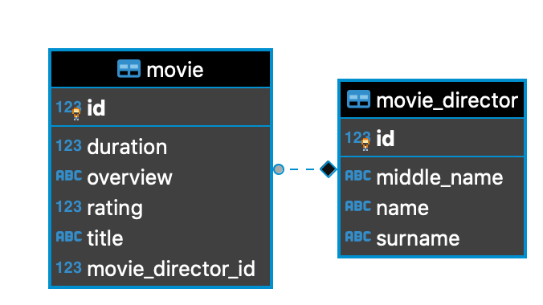

<h1 align="center">Movie Catalog Api</h3>

[](https://travis-ci.com/DonNy88/nestjs-movie-catolg)
<!-- all-shields/service-version-badge:START -->
[]() 
<!-- all-shields/service-version-badge:END -->

---

Simple REST Api that maintains a Movie catalog. 

## 📝 Table of Contents

- [Getting Started](#getting_started)
- [Deployment](#deployment)
- [Usage](#usage)
- [ER Diagram](#erDiagram)
- [Project Structure](#projectStructure)
- [Api Calls](#apiCalls)
- [Built Using](#built_using)
- [TODO](./TODO.md)
- [Authors](#authors)

## 🏁 Getting Started <a name = "getting_started"></a>

These instructions will get you a copy of the project up and running on your local machine for development and testing purposes. See [deployment](#deployment) for notes on how to deploy the project on a live system.

### Prerequisites

Clone this project with this bash command:
```bash
git clone https://github.com/DonNy88/nestjs-movie-catolg
```

For running this NestJS Application you need *Node.js*, *Nest CLI*, *Yarn* *Docker* and *Docker Compose*. If you do not have these things yet here below you can find where to get them.


- Docker for Windows [Link](https://docs.docker.com/docker-for-windows/install/)
- Docker for OS X [Link](https://docs.docker.com/docker-for-mac/install/)
- Docker compose [Link](https://docs.docker.com/compose/install/)
- Node.js [Link](https://nodejs.org/en/)
- Nest CLI [Link](https://docs.nestjs.com/cli/overview)
- Yarn [Link](https://classic.yarnpkg.com/en/docs/install)

## 🚀 Deployment <a name = "deployment"></a>

Please, see [TODO](./TODO.md) file.


## 🎈 Usage <a name="usage"></a>

For run this Spring Boot Application use this command:

```bash
docker-compose up
```

## 🔧 Running the tests <a name = "tests"></a>

```bash
yarn test
```
## ER Diagram <a name = "erDiagram"></a>



## Api Calls <a name = "apiCalls"></a>

### Movie Endpoints
#### GET /movies/all
Fetch all movies present on the system
###### Respone Body example
```json
{
  "status": "OK",
  "message": "Success",
  "body": [
    {
      "id": 1,
      "title": "Mummy",
      "overview": "The best movie",
      "duration": 300,
      "rating": 4,
      "movieDirector": {
        "id": 1,
        "name": "Donald",
        "middleName": "Emeka",
        "surname": "Achugo"
      }
    },
    {
      "id": 2,
      "title": "Mask",
      "overview": "The second best movie",
      "duration": 230,
      "rating": 3,
      "movieDirector": {
        "id": 1,
        "name": "Donald",
        "middleName": "Emeka",
        "surname": "Achugo"
      }
    }
  ]
}
```
or
```json
{
  "status": "OK",
  "message": "Success",
  "body": []
}
```
#### GET /movies?movieId={}
Fetch a movie by *movieId*
###### Respone Body example
```json
{
  "status": "OK",
  "message": "Success",
  "body": {
    "id": 2,
    "title": "Mask",
    "overview": "The second best movie",
    "duration": 230,
    "rating": 3,
    "movieDirector": {
      "id": 1,
      "name": "Donald",
      "middleName": "Emeka",
      "surname": "Achugo"
    }
  }
}
```
##### Exception Cases
###### Status Code 404 NOT FOUND
```json
{
  "status": "NOT_FOUND",
  "message": "No movie found",
  "body": null
}
```
#### POST /movies
Add a Movie into the catolg
###### Request Body example
```
{
  "title": "Mummy", // Title of the movie
  "overview": "The best movie of the world", // Description of the movie
  "duration": 300, // Duration in minutes of the movie
  "rating": 3, // Rating of the movie from 1 to 5
  "movieDirectorId": 1, // Movie director id. NB: the movie director has been saved before
}
```
###### Response Body example
```json
{
  "status": "CREATED",
  "message": "Success",
  "body": {
    "id": 3,
    "title": "Mummy",
    "overview": "The second best movie",
    "duration": 300,
    "rating": 3,
    "movieDirector": {
      "id": 1,
      "name": "Donald",
      "middleName": "Emeka",
      "surname": "Achugo"
    }
  }
}
```
##### Exception Cases
###### Status Code 404 NOT FOUND
```json
{
  "status": "NOT_FOUND",
  "message": "No Movie Director found",
  "body": null
}
```
#### PUT /movies
Update a Movie
###### Request Body example
```
{
  "title": "Mummy", // Title of the movie
  "overview": "The best movie of the world", // Description of the movie
  "duration": 300, // Duration in minutes of the movie
  "rating": 3, // Rating of the movie from 1 to 5
  "movieDirectorId": 1, // Movie director id. NB: the movie director has been saved before
}
```
###### Response Body example
```json
{
  "status": "OK",
  "message": "Success",
  "body": {
    "id": 3,
    "title": "Mummy",
    "overview": "The second best movie",
    "duration": 300,
    "rating": 3,
    "movieDirector": {
      "id": 1,
      "name": "Donald",
      "middleName": "Emeka",
      "surname": "Achugo"
    }
  }
}
```
##### Exception Cases
###### Status Code 400 BAD REQUEST
```json
{
  "status": "BAD REQUEST",
  "message": "No arguments provided",
  "body": null
}
```
###### Status Code 404 NOT FOUND
```json
{
  "status": "NOT_FOUND",
  "message": "No movie found",
  "body": null
}
```
###### Status Code 404 NOT FOUND
```json
{
  "status": "NOT_FOUND",
  "message": "No Movie Director found",
  "body": null
}
```
#### DELETE /movies?movieId={}
Remove a Movie by *movieId*
##### Exception Cases
###### Status Code 404 NOT FOUND
```json
{
  "status": "NOT_FOUND",
  "message": "No movie found",
  "body": null
}
```
#### GET /movies/searchByRating?aboveRating={} 
Fetch movies where the rating is greater than or equals to *aboveReting*
###### Response Body example
```json
{
  "status": "OK",
  "message": "Success",
  "body": [
    {
      "id": 1,
      "title": "Mummy",
      "overview": "The best movie",
      "duration": 300,
      "rating": 4,
      "movieDirector": {
        "id": 1,
        "name": "Donald",
        "middleName": "Emeka",
        "surname": "Achugo"
      }
    },
    {
      "id": 2,
      "title": "Mask",
      "overview": "The second best movie",
      "duration": 230,
      "rating": 3,
      "movieDirector": {
        "id": 1,
        "name": "Donald",
        "middleName": "Emeka",
        "surname": "Achugo"
      }
    }
  ]
}
```
##### Exception Cases
###### Status Code 400 BAD REQUEST
```json
{
  "status": "BAD_REQUEST",
  "message": "Rating must be greater than 0 and less than 6",
  "body": null
}
```
###### Status Code 404 NOT FOUND
```json
{
  "status": "NOT_FOUND",
  "message": "No movie found",
  "body": null
}
```
#### GET /movies/searchByMovieDirector?movieDirectorId={}
Fetch Movies by *movieDirectorId*
```json
{
  "status": "OK",
  "message": "Success",
  "body": [
    {
      "id": 1,
      "title": "Mummy",
      "overview": "The best movie",
      "duration": 300,
      "rating": 4,
      "movieDirector": {
        "id": 1,
        "name": "Donald",
        "middleName": "Emeka",
        "surname": "Achugo"
      }
    },
    {
      "id": 2,
      "title": "Mask",
      "overview": "The second best movie",
      "duration": 230,
      "rating": 3,
      "movieDirector": {
        "id": 1,
        "name": "Donald",
        "middleName": "Emeka",
        "surname": "Achugo"
      }
    }
  ]
}
```
##### Exception Cases
###### Status Code 404 NOT FOUND
```json
{
  "status": "NOT_FOUND",
  "message": "No Movie Director found",
  "body": null
}
```
###### Status Code 404 NOT FOUND
```json
{
  "status": "NOT_FOUND",
  "message": "The Movie Director has directed no movie yet",
  "body": null
}
```
### Movie Director Endpoints
#### GET /movies/directors/all
Fetch all movies directors present on the system
###### Respone Body example
```json
{
  "status": "OK",
  "message": "Success",
  "body": [
    {
      "id": 1,
      "name": "Donald",
      "middleName": "Emeka",
      "surname": "Achugo"
    },
    {
      "id": 2,
      "name": "Donald",
      "middleName": null,
      "surname": "Trump"
    }
  ]
}
```
or
```json
{
  "status": "OK",
  "message": "Success",
  "body": []
}
```
#### GET /movies/directors?movieDirectorId={}
Fetch a movie director by *movieDirectorId*
###### Respone Body example
```json
{
  "status": "OK",
  "message": "Success",
  "body": {
    "id": 1,
    "name": "Donald",
    "middleName": "Emeka",
    "surname": "Achugo"
  }
}
```
##### Exception Cases
###### Status Code 404 NOT FOUND
```json
{
  "status": "NOT_FOUND",
  "message": "No Movie Director found",
  "body": null
}
```
#### POST /movies/directors
Add a Movie Direcotor into the catolog
###### Request Body example
```json
{
  "name": "Donald",
  "middleName": "Emeka",
  "surname": "Achugo"
}
```
###### Response Body example
```json
{
  "status": "CREATED",
  "message": "Success",
  "body": {
    "id": 3,
    "name": "Donald",
    "middleName": "Emeka",
    "surname": "Achugo"
  }
}
```
#### PUT /movies/directors
Update a Movie Director
###### Request Body example
```json
{
  "id": 3,
  "name": "Tommy"
}
```
or
```json
{
  "id": 3,
  "name": "Tommy",
  "surname": "Smith"
}
```
###### Response Body example
```json
{
  "status": "OK",
  "message": "Success",
  "body": {
    "id": 3,
    "name": "Tommy",
    "middleName": "Emeka",
    "surname": "Achugo"
  }
}
```
or
```json
{
  "status": "OK",
  "message": "Success",
  "body": {
    "id": 3,
    "name": "Tommy",
    "middleName": "Emeka",
    "surname": "Smith"
  }
}
```
##### Exception Cases
###### Status Code 400 BAD REQUEST
```json
{
  "status": "BAD REQUEST",
  "message": "No arguments provided",
  "body": null
}
```
###### Status Code 404 NOT FOUND
```json
{
  "status": "NOT_FOUND",
  "message": "No Movie Director found",
  "body": null
}
```
#### DELETE /movies/directors?movieDirectorId={}
Remove a Movie Director by *movieDirectorId*
##### Exception Cases
###### Status Code 404 NOT FOUND
```json
{
  "status": "NOT_FOUND",
  "message": "No Movie Director found",
  "body": null
}
```
## ⛏️ Built Using <a name = "built_using"></a>

- [Docker](https://www.docker.com/)
- [Node.js](https://nodejs.org/en/about/)
- [NestJS](https://nestjs.com/)
- [Postgres](https://www.postgresql.org/)

## ✍️ Authors <a name = "authors"></a>

- [@DonNya88](https://github.com/DonNy88) - Initial work

<!-- See also the list of [contributors](https://github.com/kylelobo/The-Documentation-Compendium/contributors) who participated in this project.

## 🎉 Acknowledgements <a name = "acknowledgement"></a>

- Hat tip to anyone whose code was used
- Inspiration
- References -->
